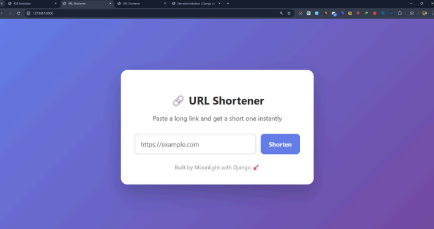
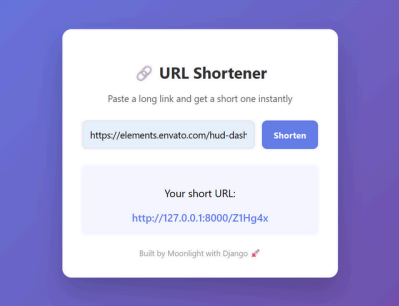

# 🔗 Django URL Shortener

A simple and efficient URL Shortener web application built with **Python** and **Django** that converts long URLs into short, shareable links with instant redirection.

<p align="center">

[](https://djshort.onrender.com)

</p>


<p align="center">

</p>

<p align="center">

</p>

This application allows users to shorten long URLs into compact links and automatically redirects visitors to the original destination when the shortened URL is opened.

---

## ✨ Features

- 🔗 Convert long URLs into short, shareable links
- ⚡ Instant redirection to the original website
- 🎯 Automatically generates unique short codes
- 💾 Stores URLs using SQLite
- 🎨 Simple and responsive user interface
- 🚀 Deployed on Render

## 🛠️ Tech Stack

- Python
- Django
- HTML5
- CSS3
- SQLite
- Gunicorn
- WhiteNoise
- Render
---

## 🚀 Installation

### 1. Clone the repository

```bash
git clone https://github.com/Moonlight12911/Django-URL-Shortener.git
cd Django-URL-Shortener
```

### 2. Create a virtual environment

```bash
python -m venv venv
```

Activate it:

**Windows**

```bash
venv\Scripts\activate
```

**macOS/Linux**

```bash
source venv/bin/activate
```

### 3. Install dependencies

```bash
pip install -r requirements.txt
```

### 4. Apply migrations

```bash
python manage.py migrate
```

### 5. Start the development server

```bash
python manage.py runserver
```

Open:

```
http://127.0.0.1:8000/
```

---

## 📌 Usage

1. Open the application.
2. Paste a long URL.
3. Click **Shorten URL**.
4. Copy and share the generated short link.
5. Opening the short link redirects to the original website.

---

## 🤝 Contributing

Contributions, issues, and feature requests are welcome. Feel free to fork the repository and submit a pull request.

---

## 📄 License

This project is licensed under the **MIT License**.
